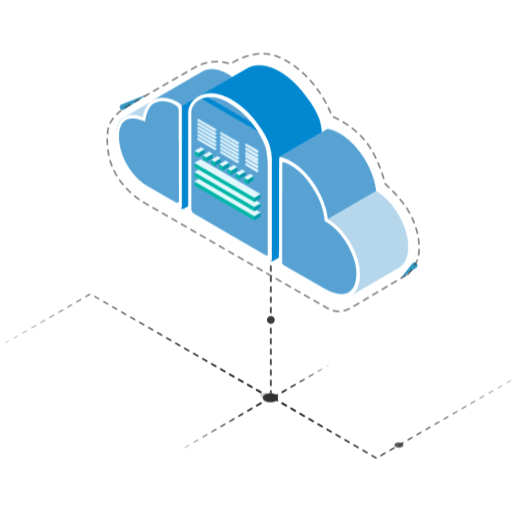

# **DEVOPS 101**

[](https://git.io/typing-svg)

## 📔 Path to Devops


Cet formations se presente dans un genre inovant: en accord avec les presept du DevOps, vous pourrez choisir le parcour qui vous ressemble, car oui il n'existe pas un seul ingenieur DevOps, le modele pluridisplinaire du devops pousse à une diversité de profil et est le symbole de la richesse de ce metier backbone de l'IT !

par consequent nous distinguerons 6 branches de talents DevOps sur lequels il y'a enormement de connaisances à aller cherhcer :) vous selectionnerer les cours en focntion des branches qui vous conviennent le mieux.

## les specialisation

###  **Automatisation**

capable d'acompagner tout le process du build à la livraison, l'ingenieur ici se specialisera dans le packaging d'application, du déploiement, configuration dans les divers environement à l'aide d'outils d'automatisation

#### **competences**

- forte maitrise technique
- adaptabilités

#### **outils**

- docker
- gitlab
- jenkins
- ansible
- ...


###  **Infrastructure**

le maitre des machines avec une vrai comprehension des divers architectures il saura choisir la plus adpaté au projet

#### **Competences**

#### **outils**


###  **Methodologie**

il saura garantir les bonnes pratiques DevOps, trouver les levier pour faire avancer le projet dans la bonne directions

#### **Competences**

#### **outils**


###  **SRE**

un operationel à l'ancienne qui se modernise et permet de monitorer l'applicatif et l'infra et aussi permet de garantir une fiabilité du produit exemplaire

#### **Competences**

#### **outils**


###  **Securité**

alias Mr robot, il aura pour mission de garantir l'implementation du zero trust, et le secure by design, il challengera et apportera un oeil averti aux questions de secu

#### **Competences**

#### **outils**


###  **Dev**

le genie avec qui tout commence, il saura develloper l'applciation avec le maximum de modularité, en respectant toutes les bonnes pratiques de dev (SOLID ...), pensera recyclage, performance, et surtout le "prod ready mindset"

#### **Competences**

#### **outils**


<b> Skills</b>
<br>
## 

<p align="center">

- **Languages**:
    
    
    
    

<br>   
    
- **Front-End Development**:

   
   
   

<br>

- **Cloud Hosting**:

    
    
<br>

- **Softwares and Tools**:

    
    
    
    
     

<br>

- **Extras**:

    
       


</p>

<br>
<br>

-----

<br>


## <b> Github Stats </b>
<br>

<div align="center">

<a href="https://github.com/0xabdulkhalid/">
  
  

</a>
</div>

<br>
<br>
<br>

-----

<br>
<br>

## <b> Let's Connect..!</b>
<br>
<div align='left'>

<ul>

<li>
<a href="https://linkedin.com/in/0xabdulkhalid" target="_blank">

</a>
</li>

<li>
<a href="https://twitter.com/0xabdulkhalid" target="_blank">

</a>
</li>

<br>

<li>
<a href="mailto:0xabdulkhalid@gmail.com" target="_blank">

</a>
</li>
	
</ul>
</div>

<br>

<br>
<br>
<br>
✨


```sh
git branch -m master main
git fetch origin
git branch -u origin/main main
git remote set-head origin -a
```


🛦 00_DevOps
🛦 01_Agile
🛦 02_Cloud
🛦 03_Docker
🛦 04_Kubernetes
🛦 05_Versioning_Git
🛦 06_Jenkins
🛦 07_Nexus
🛦 08_Automation_Ansible
🛦 09_Automation_puppet
